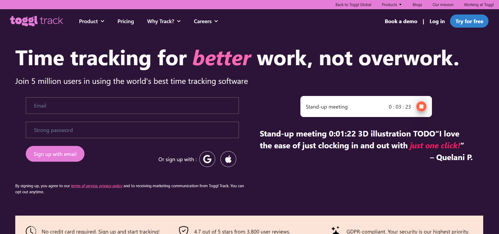
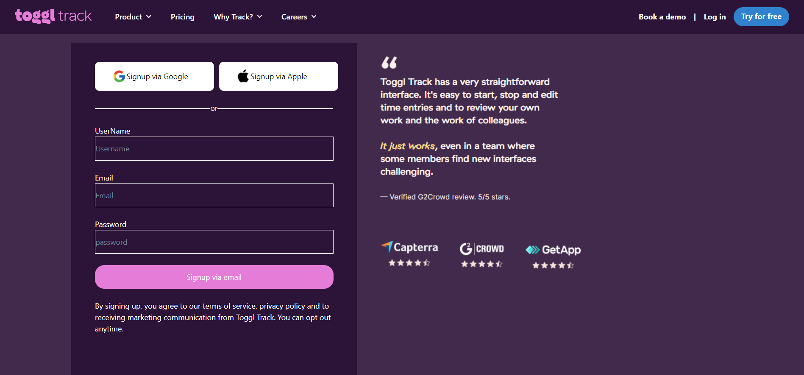
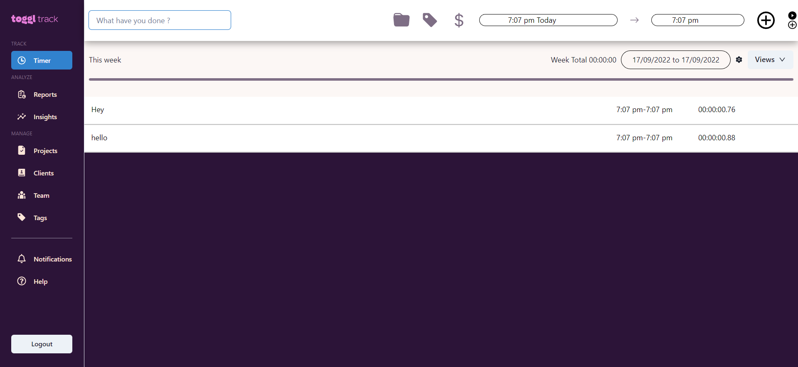
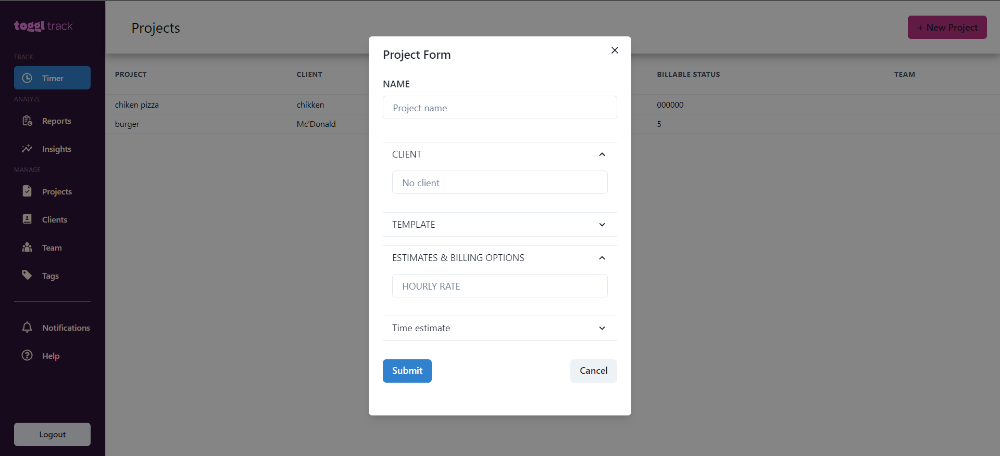

# Toggl Track clone
 Toggle is Time tracking, project-management and Reporting website

## Acknowledgements

**Original website link**: (https://toggl.com/track/)

**Vercel link of our project**:  https://toggl-clone.vercel.app/

## collaborators:
- [gourav Sahu](https://github.com/gourav017)
- [Vivek Nemade](https://github.com/VivekN11)
- [Lalith Sai](https://github.com/G-LalithSai)
- [Rohit Singh](https://github.com/Rohit24-code)
- [Harish Rayala](https://github.com/HarishRayala)

## Tech Stack:

<h1>Snapshots of our project</h1>

1. Landing page

 

2. SignUp Page

 

3. Login Page

 

4.Timer Page

 

5.Project page

6.Client page

